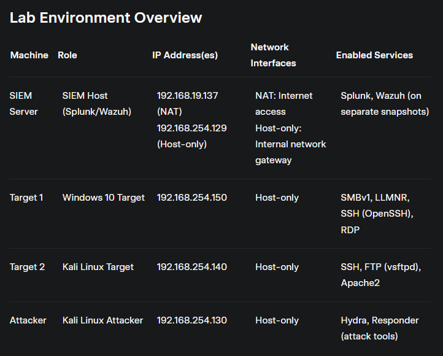
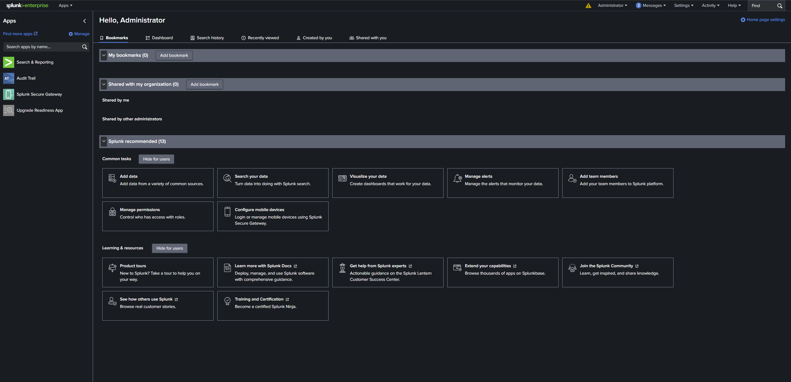
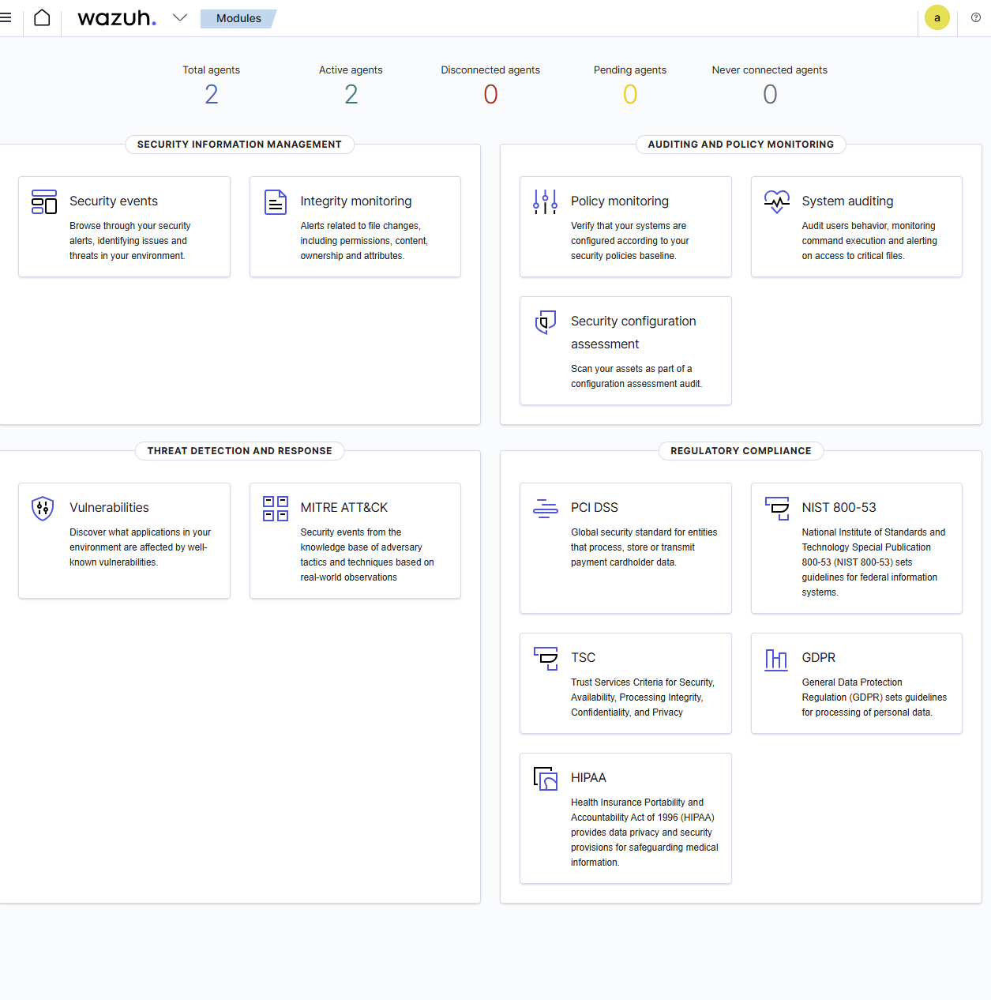
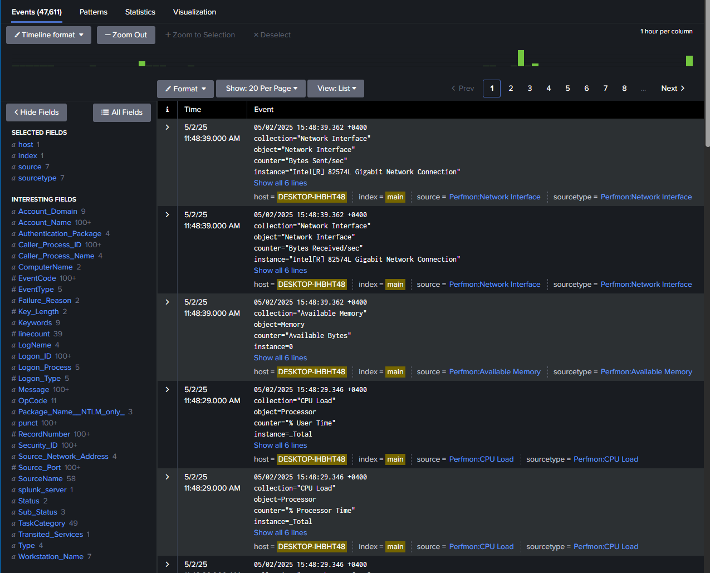
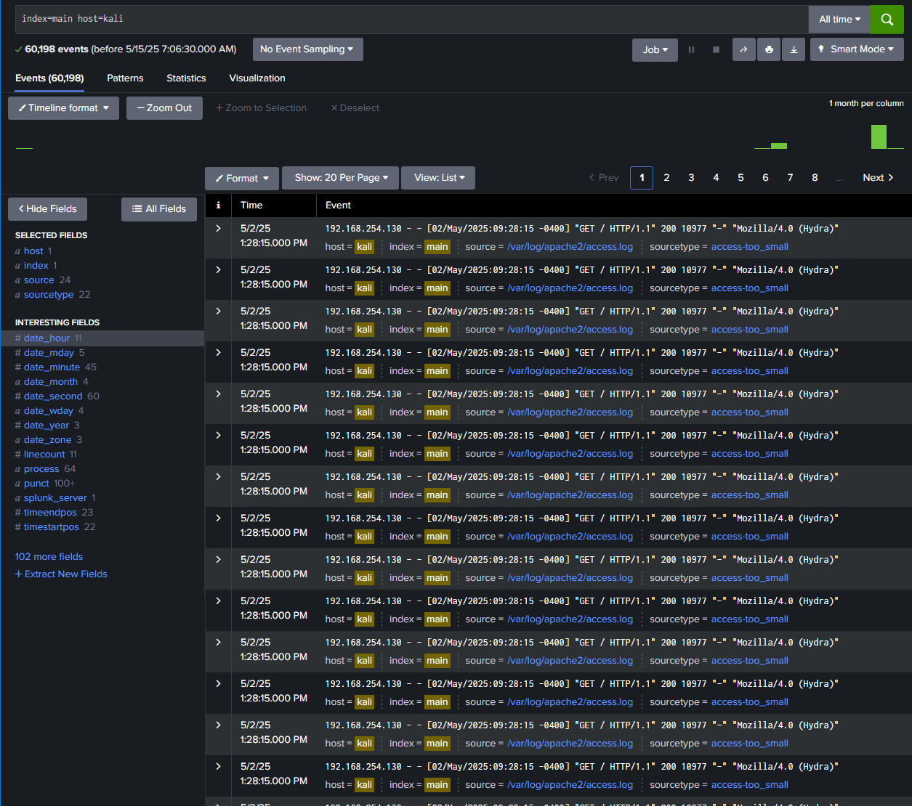
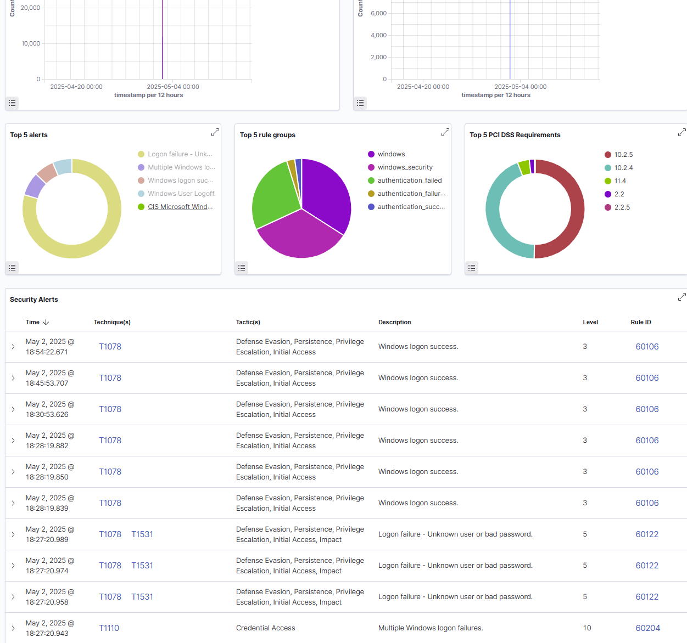
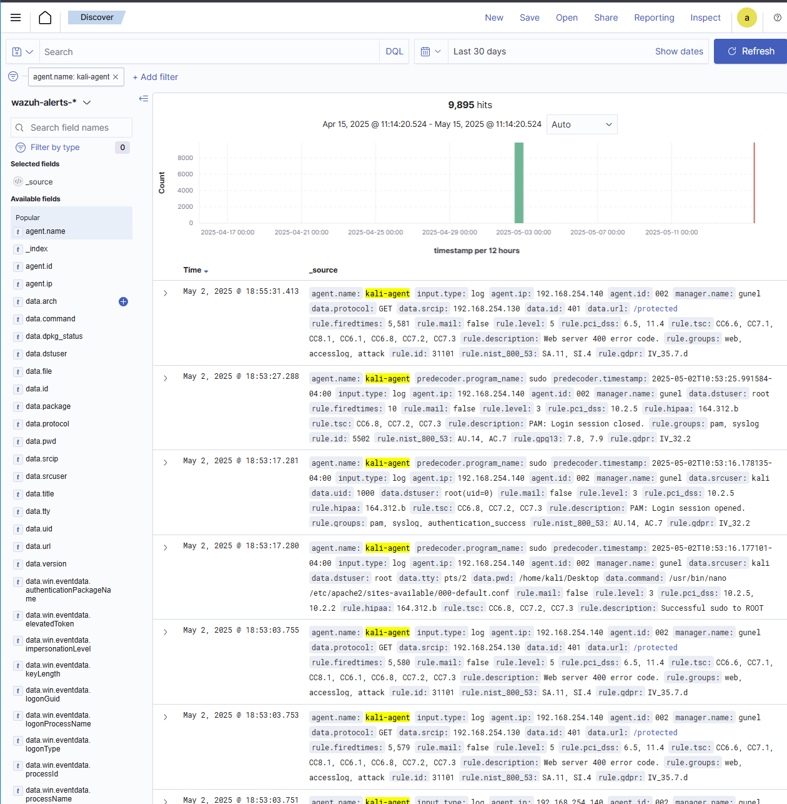

# SIEM Lab Documentation

This document details the setup, configuration, and testing of Splunk and Wazuh Security Information and Event Management (SIEM) systems in a controlled lab environment. It includes automated scripts, configuration files, and attack simulations to demonstrate log collection and analysis for security events.

## 1. Introduction
This project establishes a virtual lab to evaluate two open-source SIEM tools: Splunk Enterprise (community edition) and Wazuh. The lab simulates a network with vulnerable target machines (Windows 10 and Kali Linux) and an attacker machine (Kali Linux) to perform brute-force attacks and analyze resulting logs.

### Objectives
- Install Splunk and Wazuh on an Ubuntu server.
- Configure Splunk Universal Forwarders and Wazuh agents on Windows 10 and Kali Linux targets.
- Simulate brute-force attacks on SMB, RDP, SSH, FTP, HTTP, and LLM huntington (LLMNR attack).
- Analyze security events using Splunk and Wazuh dashboards.

For a high-level overview, see [README.md](../README.md).

## 2. Lab Environment
The lab is configured with the following machines on the 192.168.254.0/24 internal network:

| Machine        | Role                | IP Address(es)                     | Network Interfaces                     | Enabled Services                     |
|----------------|---------------------|------------------------------------|----------------------------------------|--------------------------------------|
| SIEM Server    | SIEM Host (Splunk/Wazuh) | 192.168.19.137 (NAT)<br>192.168.254.129 (Host-only) | NAT: Internet access<br>Host-only: Internal network gateway | Splunk, Wazuh (on separate snapshots) |
| Target 1       | Windows 10 Target   | 192.168.254.150                   | Host-only                              | SMBv1, LLMNR, SSH (OpenSSH), RDP     |
| Target 2       | Kali Linux Target   | 192.168.254.140                   | Host-only                              | SSH, FTP (vsftpd), Apache2           |
| Attacker       | Kali Linux Attacker | 192.168.254.130                   | Host-only                              | Hydra, Responder (attack tools)      |

**Notes**:
- All machines are connected to the internal network (192.168.254.0/24).
- The SIEM Server acts as the gateway for the internal network.
- Splunk and Wazuh are installed on separate snapshots of the Ubuntu server to ensure isolation.



## 3. Splunk SIEM Setup
Splunk Enterprise (version 9.2.1) was installed on the Ubuntu server (192.168.254.129) using an automated script.

### Steps
1. **Run the Setup Script**:
   ```bash
   sudo ../scripts/splunk_setup.sh
   ```
   - Downloads Splunk from [Splunk's website](https://www.splunk.com/en_us/download/splunk-enterprise.html).
   - Extracts to `/opt/splunk`.
   - Starts Splunk, accepts the license, and sets admin credentials (username: `splunk`, password: `salam123`).
   - Configures Splunk to receive logs on port 9997.
   - Enables boot-start for the `splunk` user.

2. **Verify Installation**:
   - Access the Splunk web interface at `http://192.168.254.129:8000`.
   - Confirm the dashboard is accessible.



For script details, see [splunk_setup.sh](../Scripts/splunk_setup.sh).

## 4. Splunk Forwarder Configuration
Splunk Universal Forwarders were installed on the Windows 10 (192.168.254.150) and Kali Linux (192.168.254.140) targets to send logs to the Splunk server.

### Windows 10 Forwarder
1. **Install Forwarder**:
   - Download and install the Splunk Universal Forwarder MSI package.
2. **Configure Inputs**:
   - Copy [inputs_windows.conf](../Configs/splunk/inputs_windows.conf) to `C:\Program Files\SplunkUniversalForwarder\etc\system\local\inputs.conf`.
   - Monitors Windows Security Event Logs (`WinEventLog://Security`).
3. **Restart Forwarder**:
   ```bash
   "C:\Program Files\SplunkUniversalForwarder\bin\splunk.exe" restart
   ```

### Kali Linux Forwarder
1. **Install Forwarder**:
   - Download and extract the Splunk Universal Forwarder to `/opt/splunkforwarder`.
2. **Configure Inputs**:
   - Copy [inputs_kali.conf](../Configs/Splunk/inputs_kali.conf) to `/opt/splunkforwarder/etc/system/local/inputs.conf`.
   - Monitors `/var/log/auth.log` (SSH) and `/var/log/vsftpd.log` (FTP).
3. **Restart Forwarder**:
   ```bash
   sudo /opt/splunkforwarder/bin/splunk restart
   ```

## 5. Wazuh SIEM Setup
Wazuh (version 4.11) was installed on a separate Ubuntu server snapshot (192.168.254.129) using an automated script.

### Steps
1. **Run the Setup Script**:
   ```bash
   sudo ../scripts/wazuh_setup.sh
   ```
   - Downloads and runs the Wazuh installation script.
   - Installs Wazuh manager, indexer, and dashboard.
   - Extracts admin credentials to `/tmp/wazuh-installation-credentials.txt`.

2. **Verify Installation**:
   - Access the Wazuh dashboard at `https://192.168.254.129:443`.
   - Confirm services (manager, indexer, dashboard) are running.



For script details, see [wazuh_setup.sh](../Scripts/wazuh_setup.sh).

## 6. Wazuh Agent Configuration
Wazuh agents were installed on the Windows 10 (192.168.254.150) and Kali Linux (192.168.254.140) targets to send logs to the Wazuh manager.

### Windows 10 Agent
1. **Install Agent**:
   - Download and install the Wazuh agent MSI package.
2. **Configure Agent**:
   - Copy [ossec_windows.conf](../Configs/wazuh/ossec_windows.xml) to `C:\Program Files (x86)\ossec-agent\ossec.conf`.
   - Monitors Windows Security Event Logs.
3. **Restart Agent**:
   ```bash
   net stop wazuh
   net start wazuh
   ```

### Kali Linux Agent
1. **Install Agent**:
   - Install the Wazuh agent via `apt`.
2. **Configure Agent**:
   - Copy [ossec_kali.conf](../Configs/wazuh/ossec_kali.xml) to `/var/ossec/etc/ossec.conf`.
   - Monitors `/var/log/auth.log` and `/var/log/vsftpd.log`.
3. **Restart Agent**:
   ```bash
   sudo systemctl restart wazuh-agent
   ```

## 7. Attack Simulation
Brute-force attacks were simulated from the Kali Linux attacker machine (192.168.254.130) using Hydra and Responder.

### Steps
1. **Run the Attack Script**:
   ```bash
   sudo ../scripts/attack_simulation.sh
   ```
   - **Windows 10 (192.168.254.150)**:
     - SMB: `hydra -l Administrator -P /usr/share/wordlists/rockyou.txt smb://192.168.254.150`
     - RDP: `hydra -l Administrator -P /usr/share/wordlists/rockyou.txt rdp://192.168.254.150`
     - SSH: `hydra -l Administrator -P /usr/share/wordlists/rockyou.txt ssh://192.168.254.150`
     - LLMNR: `responder -I eth0 -wrf`
   - **Kali Linux (192.168.254.140)**:
     - SSH: `hydra -l kali -P /usr/share/wordlists/rockyou.txt ssh://192.168.254.140`
     - FTP: `hydra -l kali -P /usr/share/wordlists/rockyou.txt ftp://192.168.254.140`
     - HTTP: `hydra -l kali -P /usr/share/wordlists/rockyou.txt http-get://192.168.254.140`

2. **Verify Attacks**:
   - Check `/var/log/attack_simulation.log` for attack outputs.


For script details, see [attack_simulation.sh](../Scripts/attack_simulation.sh).

## 8. Log Analysis
Logs from the attacks were analyzed in Splunk and Wazuh to detect security events.

### Splunk Analysis
- **Search Query**: `index=main`
- **Windows 10**:
  - Sourcetype: `WinEventLog:Security`
  - Detected failed login attempts (EventCode 4625).
  - Visualized attack spikes in the dashboard.
  
- **Kali Linux**:
  - Sourcetypes: `linux_secure` (SSH), `vsftpd_log` (FTP)
  - Detected authentication failures.
  

### Wazuh Analysis
- **Dashboard**: Security Events module
- **Windows 10**:
  - Alerts for brute-force attempts (e.g., Rule ID 60103).
  
- **Kali Linux**:
  - Alerts for SSH (Rule ID 5710), FTP, and HTTP scanning (Rule ID 31101).
  

## 9. Conclusion
This lab demonstrated the capabilities of Splunk and Wazuh in detecting and analyzing security events in a controlled environment. The automated scripts and configurations provided streamline the setup process, making it reproducible for educational purposes.

**Security Note**: This project is for **educational purposes only**. Do not use in production or against systems without permission.

For additional details, see [LAB2.docx](../Docs/LAB2.docx) (Word format).
